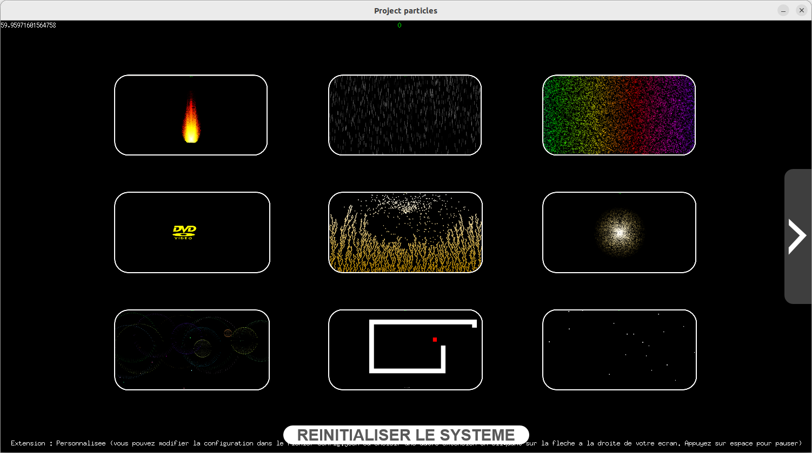
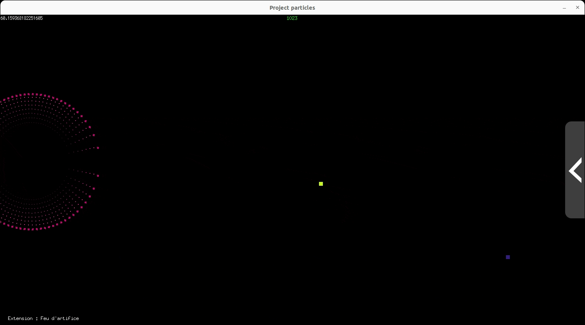
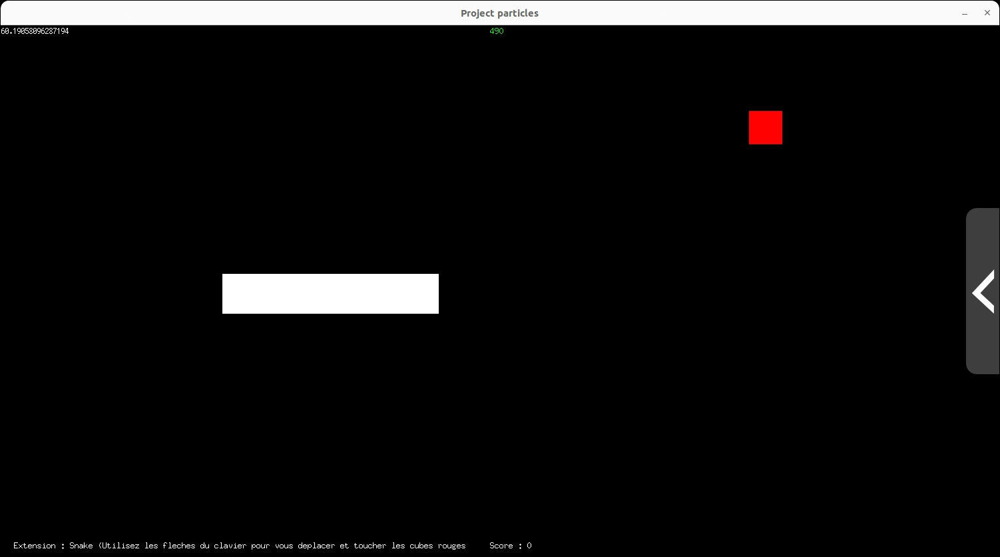
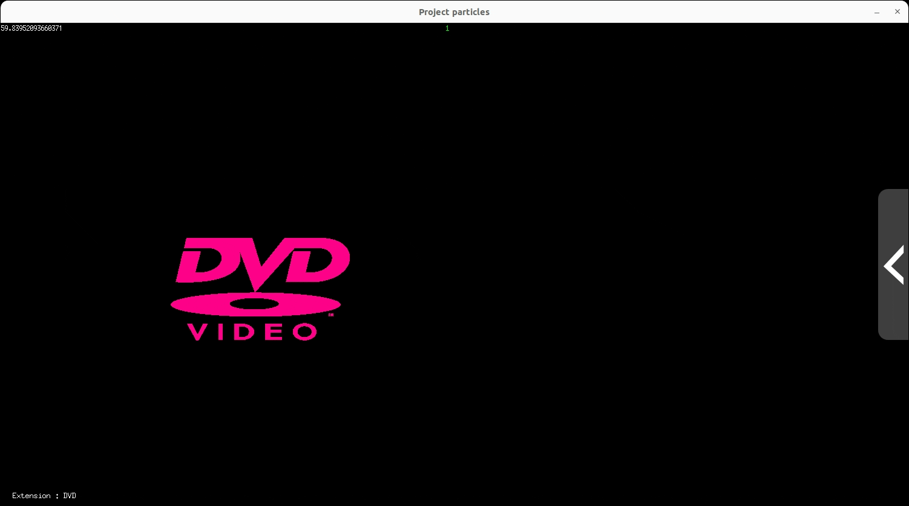
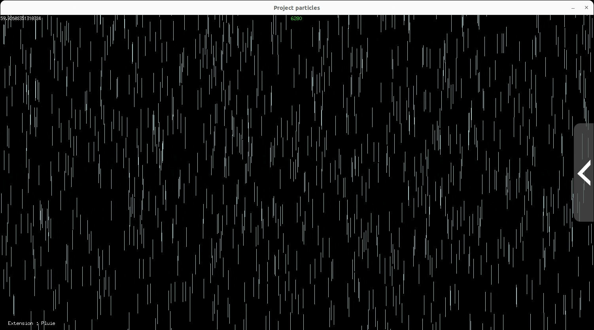

[](README.md) 

# Particules

J'ai travaillé sur ce projet lors de ma première année de BUT Informatique.
Le but de ce projet était de réussir à contrôler des "particules". Le projet s'est découpé en deux parties :
- Une première qui consistait au contrôle de base des particules : fréquence d'apparition, vitesse, orientation, gravité, couleur...
- Une deuxième : "Extensions", où nous étions libre de créer ce que l'on souhaitait avec ces particules.

Le projet a été réalisé en Go avec la librairie [Ebiten](https://ebitengine.org/) pour l'interface graphique.

Je souhaitais explorer ce qui était possible avec ces particules et j'ai donc essayé de créer des extensions qui utiliseraient diverses mécaniques des particules (vitesse, gravité, couleur, personnalisation des images, inputs...) pour créer des simulations intéressantes.


# Installation et configuration

Pour faire fonctionner ce programme, il faut avoir installer [Go](https://go.dev/) sur sa machine.

Il faut tout d'abord cloner ce dépôt.

Pour compilter le programme, exécuter :
```
go build
```

Puis, pour le lancer, exécuter :
```
./project-particles
```

Il suffit ensuite de suivre les intructions affichées en bas à gauche de la fenêtre.


# Screenshots


*Menu de sélection des extensions*



*Feu d'artifice*



*Snake*


*Coraux*



*Logo DVD*


*Arc-en-ciel*



*Pluie*


*Feu*


*Cercle*


# A améliorer

Ce projet ayant été réalisé tôt dans mon cursus, il y a de nombreuses choses à améliorer, notamment concernant l'optimisation.
En effet, les particules sont créées mais ne sont détruites que lorsque le joueur change d'extension. Le programme devient donc inutilisable autour de 300k particules (ce qui peut arriver assez vite avec certaines extensions).
Une solution aurait pu être de réutiliser les particules déjà créées, cela aurait permis que chaque extension ait un certain nombre de particules nécessaires qui ne serait jamais dépasser.


# Contact

Email: [quentin.chauvelon@gmail.com](mailto:quentin.chauvelon@gmail.com) 

LinkedIn: [Quentin Chauvelon](https://www.linkedin.com/in/quentin-chauvelon/) 