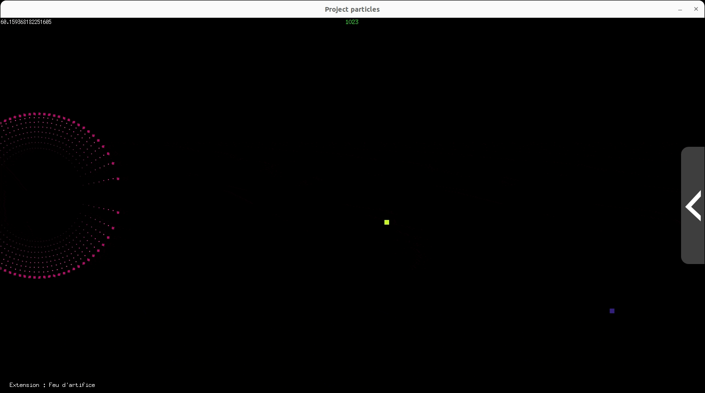
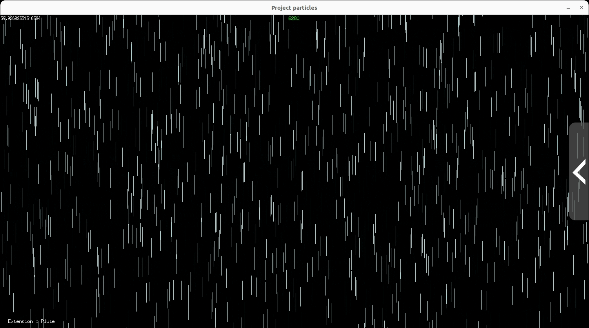

[](README.fr.md) 

# Particles

I worked on this project in my first year of BUT in Computer Science.
The goal of the project was to control 'particles'. It was divided in two parts:
- The first one involved basic control of particles : spawning frequency, speed, orientation, gravity, color...
- The second one aimed at adding 'Extensions', where we were free to create whatever we wanted with particles.

The project was developed in Go with the [Ebiten](https://ebitengine.org/) library for the user interface.

I wanted to explore what could be possible with those particles and so I tried to create extensions which would use diverse particles mechanics (speed, gravity, color, custom images, iputs...) to create interesting simulations.


# Installation and setup

In order for the program to work, you need [Go](https://go.dev/) installed on your machine.

First, clone this repository.

To compile the program, execute:
```
go build
```

Then, to launch it, execute:
```
./project-particles
```

At that point, you can follow the instructions displayed at the bottom left of the window.


# Screenshots


*Extensions selection menu*



*Fireworks*


*Snake*


*Coraux*


*DVD logo*


*Rainbow*



*Rain*


*Fire*


*Circle*


# To improve

I worked on this project early in my studies, and so there are a lot of things that could be improved, particularly regarding optimization.
Indeed, particles are being created but are only destroyed once the player changes extension. Thus, the program becomes unusable at around 300k particles (which can happen pretty quickly with some extensions).
A solution could have been to reuse already created particles, this would have allowed each extensions to have a set number of particles they would need to run and would never go above it.


# Contact

Email: [quentin.chauvelon@gmail.com](mailto:quentin.chauvelon@gmail.com) 

LinkedIn: [Quentin Chauvelon](https://www.linkedin.com/in/quentin-chauvelon/) 
